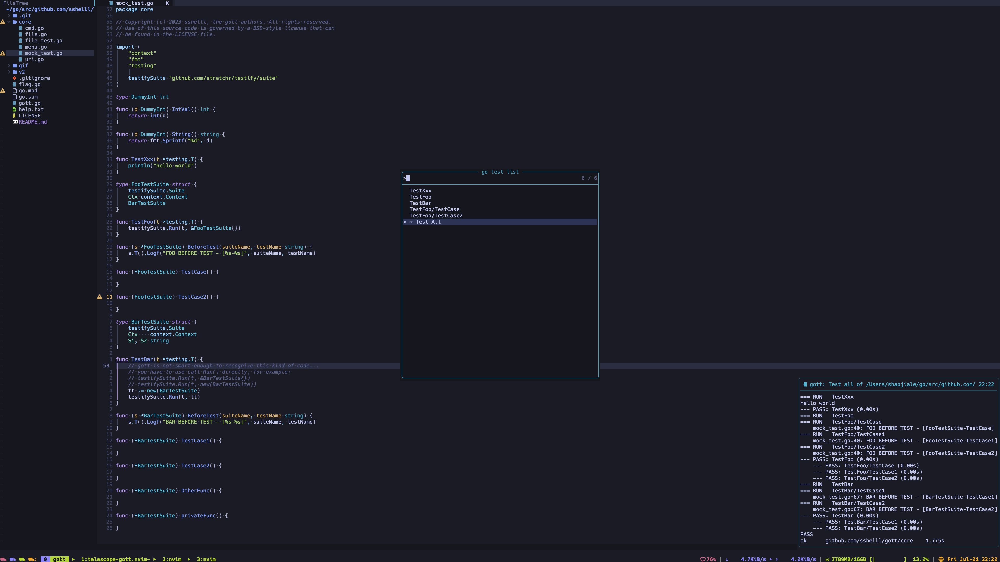

# telescope-gott.nvim

> A nvim go test runner based on [gott@v2.x.x](https://github.com/sshelll/gott) and [telescope.nvim](https://github.com/nvim-telescope/telescope.nvim).  
> This extension helps you choose and run a go test func with `telescope`.


## Demo




## Requirements

1. [gott@v2.x.x](https://github.com/sshelll/gott) (required)

> `go install github.com/sshelll/gott/v2@latest`

2. [telescope.nvim](https://github.com/nvim-telescope/telescope.nvim) (required)

> `Plug 'nvim-telescope/telescope.nvim', { 'tag': '0.1.x' }`

3. [gott.nvim](https://github.com/sshelll/gott.nvim) (optional, but highly recommend)
> `Plug 'sshelll/gott.nvim'`


## Install

use your nvim plug manager, for example:

`Plug 'sshelll/telescope-gott.nvim'`


## Setup

```lua
require('telescope').load_extension('gott')
```

## Config
```lua
require('telescope').setup {
    defaults = {
        -- ...
    },
    pickers = {
        -- ...
    },
    -- config telescope-gott here ⬇️
    extensions = {
        gott = {
            test_args = "-v -vet=off", -- go test args
            test_args_list = {
                "-v",
                '-gcflags=\"all=-l -N\" -v'
            },                         -- go test args list, if this is empty, use test_args. Otherwise, you'll see another picker to choose args.
            timeout = 3000,            -- try to close go test result notification after 3s.
            keep = function()          -- decide whether to keep the notification after timeout(3s).
                return false           -- you can use 'return true' to keep the notification window forever.
            end,
            render = 'default',        -- default / minimal / simple / compact, controls the notification style.
            theme = 'dropdown',        -- cursor / dropdown / ivy, telescope picker theme
            layout_config = {          -- telescope picker layout
                width = 0.2,
                height = 0.4,
            },
            display_with_buf = {       -- display go test result with buf instead of vim.notify
                enabled = false,       -- set to true to enable this feature
                modifiable = false,    -- set to true to make the buf modifiable
                height = 20,           -- set the buf height
            },
        },
    }
}
```


## Usage

1. `:Telescope gott`, use this command to open the test selector.
2. `:lua require('notify').dismiss()`, use this command to clear the test result pop-up notifications.

> It's recommended to make your own custom key map or cmd for the 2nd command.
>
> Also note that the 2nd command will clear all notifications made by the 'notify' plug.
>
> If you have `gott.nvim` installed, you can use `:GottClear` instead of the 2nd command.


## Tips!

There's similar tool to run test - [gott.nvim](https://github.com/sshelll/gott.nvim).

The differences between `gott.nvim` and `telescope-gott.nvim`:  
1. `gott.nvim` provides a vim cmd to run the test under the cursor, while `telescope-gott.nvim` provides a interactive way to choose a go test to run.
2. `gott.nvim` allows you to enter go test args, such as `:Gott -v -race`, while `telescope-gott.nvim` can only exec go tests with configured args.

And that's why I highly recommend you to install both of them 🎉!
